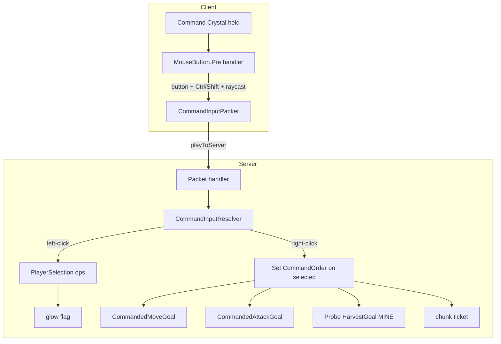

# V2b — R5: Command Crystal (select + orders) — slice plan

Implementation plan for R5 (shape **A8**). Read alongside [shaping.md](shaping.md) (R5 detail table + A8 row). This is the ground-truth implementation plan for the V2b slice; if scope shifts here, ripple the change up into shaping.md's A8 row and Slices table.

## The control scheme (target behavior)

Command inputs fire **only while the Command Crystal is held in the main hand** (R5.11). While held, the Crystal suppresses the vanilla click and reinterprets it:

| Input | Target under crosshair | Effect |
|-------|------------------------|--------|
| Left-click | friendly unit | **Select** — selection becomes exactly that unit (R5.1) |
| Shift + Left-click | friendly unit | **Toggle** that unit in/out of selection (R5.2) |
| Ctrl + Left-click | friendly unit | **Select all** friendly units of that unit's type within radius of the player (R5.3) |
| Ctrl + Shift + Left-click | friendly unit | **Toggle all** friendly units of that type within radius (R5.4) |
| Left-click | block / air / non-friendly | No-op — current selection is left untouched |
| Right-click | enemy unit | **Attack** — all selected units focus that target (R5.5) |
| Right-click | block | **Move** — selected units path to that block (R5.6). A selected **Probe** on a harvestable block instead gets **Mine** (R5.12) |
| Right-click | air (no hit) | **Move** — all selected units path toward the look vector, to the farthest point in view (R5.7) |

## Key decisions

1. **Gated on a held item, not always-on** (confirmed with user). `InputEvent.MouseButton.Pre` fires for *every* in-world click; if command mode were always-on it would swallow all mining, block-placing, and chest-opening. Gating on "holding the Command Crystal" (like the earlier A8 wand) confines the reinterpretation to command mode.
2. **All input is captured client-side and sent as one packet.** The dedicated server is never told whether **Ctrl** is held (only Shift, via sneak state). R5.3/R5.4 need Ctrl, so the client must read the modifiers and raycast, then send a single `CommandInputPacket`. This also lets left-click and right-click share one code path.
3. **`InputEvent.MouseButton.Pre` is the capture hook** (client-only, cancelable, exposes `getButton()` + `getModifiers()`). We cancel it in command mode so vanilla attack/use never runs, then do our own raycast. (`InteractionKeyMappingTriggered` is the fallback hook but doesn't expose modifiers directly.)
4. **Orders live on the unit as a `CommandOrder` data attachment**, read by two goals installed on each unit. This is faction-generic (works on any `Mob`) and consistent with `FactionAttachments` — no shared unit base class needed, since Zealot extends Zombie and Dragoon extends Skeleton.
5. **"Move" is a plain move that keeps auto-defense.** Selected units path to the destination; the existing `FactionTargetGoal` still lets them defend if an enemy comes into range en route. Actively hunting along the path (true attack-move) is deferred — only right-click-on-enemy issues a hard focus.
6. **Selection glow uses the vanilla glowing flag (server-set), MVP-shared.** Correct for single-player. Per-player client-only glow is a V5 item (already noted in the Slices table).
7. **Commandable units for V2b: Zealot, Dragoon, and Probe.** Combat units get MOVE + ATTACK (`CommandableGoals.install`). Probes are commandable too (R5 addendum): they get MOVE (via the same `CommandedMoveGoal`) and a **MINE** order that reuses their existing `HarvestGoal` pointed at a player-chosen harvestable block. A Probe ignores ATTACK orders (workers don't fight); combat units are never issued MINE. The `CommandOrder` and goal machinery stay generic so Zerg units opt in later.

## Affordances

### UI affordances (client)

| Affordance | Place | Wires out |
|-----------|-------|-----------|
| Command Crystal item (held) | Hotbar / main hand | Enables command mode; tooltip lists controls |
| Mouse click capture | `InputEvent.MouseButton.Pre` handler | Reads button + Ctrl/Shift, raycasts crosshair (entity/block/miss up to ~64 blocks), cancels vanilla action, sends `CommandInputPacket` |
| Selection glow | Entity render (vanilla glowing flag) | Visual feedback for R5.9 |

### Non-UI affordances (server)

| Affordance | Place | Wires out |
|-----------|-------|-----------|
| `CommandInputPacket` handler | `playToServer` payload handler | Validates acting `ServerPlayer` is holding the Crystal; dispatches to resolver |
| `CommandInputResolver` | server logic | Left → selection op; Right → order op. Per-unit order in `orderFor`: Probe+harvestable → MINE, Probe+attack → skip, else MOVE/ATTACK |
| `PlayerSelection` | per-player attachment (`Set<UUID>`) | `setSingle / toggle / selectAllOfType / toggleAllOfType`; prunes dead/invalid on read; toggles glow |
| `ControlledFaction` | ownership helper | Single chokepoint for "which faction does this player command" (MVP: Protoss); keeps race-selection future out of the resolver |
| Radius type-scan | `PlayerSelection` helper | Finds friendly units of a given `EntityType` within radius of the player (R5.3/R5.4) |
| `CommandOrder` attachment | per-unit attachment | `{kind: NONE\|MOVE\|ATTACK\|MINE, pos?, targetUuid?}`; set on every selected unit |
| `CommandedMoveGoal` | unit `goalSelector` (high prio) | Navigates to `order.pos`; clears order on arrival/no-progress. Installed on combat units **and Probe** |
| `CommandedAttackGoal` | combat `targetSelector` (prio 0) | Forces `order.targetUuid` as attack target over auto-acquire; clears when target dead/gone |
| Probe `HarvestGoal` (MINE-aware) | Probe `goalSelector` | Honors a MINE order: mines the commanded block (bypassing home-radius search), clears the order once depleted, then reverts to auto-harvest |
| Order chunk-loading | order lifecycle | Registers a short-lived chunk ticket around a unit with an active order ⚠️ (spike) |

### Wiring

## Implementation steps

1. **`command/CursorItem`** — plain `Item` marker with a controls tooltip; register in `AsteriskCraft` (`DeferredRegister.Items`) and add to the creative tab. Granted to the player in `GameBootstrap` when the starting base is placed.
2. **`command/CommandOrder`** + **`CommandAttachments`** — record `CommandOrder(Kind kind, Optional<BlockPos> pos, Optional<UUID> target)` with a `Codec`; register a serialized `AttachmentType<CommandOrder>` (default = empty/none). Applied to any `Mob`.
3. **`command/PlayerSelection`** + attachment — `Set<UUID>` per player (serialization optional; fine to reset on relog). Ops: `setSingle`, `toggle`, `addAllOfType`, `toggleAllOfType`, plus a `pruneAndGet(level)` that drops dead/invalid entities and returns live `Mob`s. Toggling membership sets/clears the glowing flag on affected units.
4. **`command/CommandInputPacket`** — `CustomPacketPayload` `{int button, boolean ctrl, boolean shift, HitKind kind, int entityId, BlockPos pos, Vec3 farPoint}` with a `StreamCodec`. Register via `RegisterPayloadHandlersEvent` → `registrar.playToServer(...)`, handler on the main thread (`IPayloadContext.player()` gives the `ServerPlayer`).
5. **Client input handler** (client-only, `AsteriskCraftClient`/new `command/client` class) — on `MouseButton.Pre`: bail unless `player.getMainHandItem()` is the Crystal and `Minecraft.screen == null`; read `getButton()` (0=left,1=right) + `getModifiers()` (GLFW ctrl/shift bits); do a custom raycast (`level.clip` for blocks + entity sweep up to ~64 blocks) to classify ENTITY/BLOCK/MISS and capture entityId/pos/farPoint; `event.setCanceled(true)`; send the packet.
6. **`command/CommandInputResolver`** (server) — re-validate the Crystal is held. Left-click: resolve the hit friendly unit and apply the selection op (`setSingle`/`toggle`/`addAllOfType`/`toggleAllOfType`); left-click on nothing → clear. Right-click: build a `CommandOrder` (ATTACK if hit entity is an enemy of the player's faction, else MOVE to `pos`/`farPoint`) and set it on every selected unit; play a confirm sound. "Friendly" = unit `Faction` == player's controlled faction (PROTOSS in MVP), resolved via `FactionAttachments`.
7. **`entity/ai/CommandedMoveGoal`** — `canUse()` when the unit's order is MOVE and it's not yet within ~1.5 blocks; `start()` navigates to `order.pos`; `canContinueToUse()` until arrival/path failure; `stop()` clears the order. High priority in `goalSelector` (above `WaterAvoidingRandomStrollGoal`).
8. **`entity/ai/CommandedAttackGoal`** — `targetSelector` priority 0 (above `FactionTargetGoal`): when order is ATTACK and target is alive + still an enemy, force it as `setTarget`; clear the order when the target dies/vanishes.
9. **Install goals** — add a static `CommandableGoals.install(mob, goalSelector, targetSelector)` and call it from `ZealotEntity.registerGoals()` and `DragoonEntity.registerGoals()`.
10. **Order chunk-loading** ⚠️ — while a unit holds an active order, keep its chunk (and a small radius) loaded so cross-chunk marches don't stall. Resolve mechanism in the spike below before building; if it slips, V2b still demos with the player nearby (chunks loaded), so this can land as a follow-up.

## Open spike

**S-chunk — order-driven chunk loading (resolves A8.9 / R5.10).** How do units keep their path chunks loaded in NeoForge 26.1.2? Questions: (1) the current ticket API (`ServerLevel.setChunkForced` vs. a `TicketController`/`ForcedChunkManager` registration) and its lifetime semantics; (2) where to hook the add/remove so a ticket is released when the order clears or the unit dies; (3) whether a per-unit ticket radius or a per-order corridor is cheaper. *Complete when we can describe the exact calls to load/unload a chunk for the duration of an order.* Everything else in A8 is verified (see the API-notes additions), so this is the only flagged part.

## Verification

**Unit tests** (`./gradlew test` — pure logic only; tags/input/rendering aren't bound in the JUnit bootstrap):
- `PlayerSelection` ops: `setSingle` replaces, `toggle` adds then removes, `addAllOfType`/`toggleAllOfType` filter by type + faction + radius, pruning drops invalids. Use plain faction/UUID fixtures, no world clicks.
- `CommandOrder` codec round-trips (MOVE with pos, ATTACK with target, empty).
- `CommandInputResolver` order-kind selection: enemy hit → ATTACK, block/air hit → MOVE (feed a stub hit + faction, assert the produced order — no client input).

**Manual (`./gradlew runClient`)** — the demo script, since input capture, glow, and pathing need the real client:
1. Hold the Crystal; left-click one Zealot → only it glows; move order sends it; Shift-click a second → both glow.
2. Ctrl-click one Zealot among several → all Zealots in radius glow but Dragoons don't; Ctrl+Shift-click again → they drop out.
3. Right-click a Hive/enemy → squad attacks it; right-click distant ground → squad moves; right-click sky → squad walks toward look direction.
4. Sanity: with the Crystal **not** held, left/right-click mine/place/attack normally (R5.11).
5. Chunk test (once S-chunk lands): order a squad to attack-move to the Hives from outside their simulation distance and confirm they arrive.

**`./gradlew runServer`** — join the dedicated server, issue a full round of orders; confirm no client-only class loads server-side (input handler must be client-dist-only) and no crash.

## Fit check — A8 × R5

| Req | Requirement | A8 |
|-----|-------------|:--:|
| R5.1 | Left-click friendly unit → select exactly it | ✅ |
| R5.2 | Shift+left-click → toggle unit | ✅ |
| R5.3 | Ctrl+left-click → select all of type in radius | ✅ |
| R5.4 | Ctrl+Shift+left-click → toggle all of type in radius | ✅ |
| R5.5 | Right-click enemy → attack focus | ✅ |
| R5.6 | Right-click block → move to block | ✅ |
| R5.7 | Right-click air → move toward look | ✅ |
| R5.8 | Per-player selection; own-faction only | ✅ |
| R5.9 | Selected units glow | ✅ |
| R5.10 | Order pathing across chunk boundaries | ❌ |
| R5.11 | Inputs only fire while Crystal held | ✅ |

**Notes:**
- R5.10 is ❌ until spike **S-chunk** resolves the chunk-ticket mechanism (A8.9 is the only flagged part). All other mechanisms are verified against the 26.1.2 sources.
